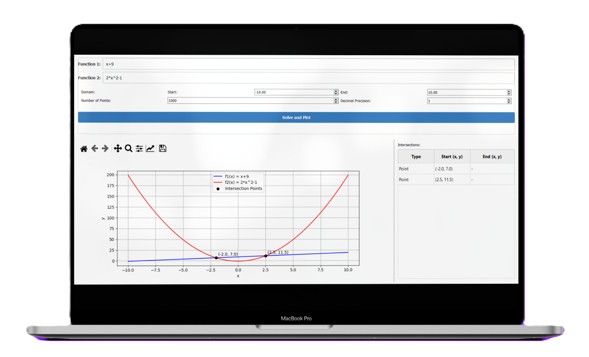

# Function Solver

A Python-based GUI application for plotting and finding intersections between mathematical functions. Built with PySide2 and Matplotlib, this tool provides an intuitive interface for mathematical function analysis.



## Features

### 1. Interactive Function Input
- Input two mathematical functions using standard notation
- Supports operators: +, -, *, /, ^ (power), log10(), sqrt()
- Real-time input validation and error feedback

### 2. Advanced Plotting
- Dynamic function plotting with customizable domain
- Automatic intersection detection (points and intervals)
- Interactive plot with zoom and pan capabilities
- Color-coded function graphs for easy distinction


### 3. Domain Handling
- Intelligent domain restriction detection for sqrt() and log10()
- Option to plot only valid domains
- Clear visual feedback for domain restrictions


### 4. Results Display
- Detailed intersection table showing points and intervals
- Configurable decimal precision
- Clear annotations on the plot


## Project Structure
```
function_solver/
├── src/
│   ├── main.py
│   ├── function_parser.py
│   ├── widgets/
│   │   ├── intersection_table.py
│   │   ├── plot_settings.py
│   │   └── main_window.py
│   └── utils.py
├── tests/
│   ├── conftest.py
│   ├── test_function_parser.py
│   ├── test_intersection_table.py
│   ├── test_plot_settings.py
│   ├── test_main_window.py
│   └── test_integration.py
├── resources/
│   └── style.qss
└── requirements.txt
```

## Usage

1. Run the application:
```bash
python src/main.py
```

2. Enter two functions in the input fields using standard mathematical notation:
   - Example 1: `5*x^2 + 2*x`
   - Example 2: `log10(x + 1)`
   - Example 3: `sqrt(x^2 + 4)`

3. Adjust plot settings if needed:
   - Domain range
   - Number of points for calculation
   - Decimal precision for results

4. Click "Solve and Plot" to generate the visualization

## Supported Mathematical Operations

| Operator | Description | Example |
|----------|-------------|---------|
| + | Addition | `x + 1` |
| - | Subtraction | `x - 2` |
| * | Multiplication | `3*x` |
| / | Division | `x/2` |
| ^ | Power | `x^2` |
| log10() | Base-10 logarithm | `log10(x)` |
| sqrt() | Square root | `sqrt(x)` |

## Testing

The project includes comprehensive tests using pytest and pytest-qt:

1. Install test dependencies:
```bash
pip install pytest pytest-qt
```

2. Run tests:
```bash
pytest tests/
```

Test coverage includes:
- Unit tests for function parsing
- Widget tests
- Integration tests
- End-to-end functionality tests

## Handled Challenges

1. Domain Restrictions: My program will tell you that the current domain has a part that is not valid and ask you if you want to plot only the valid part.
   - log10() requires x > 0
   - sqrt() requires x ≥ 0

2. Intersection Detection: The program will find the points and intervals where the two functions intersect.
   - Points: Exact x and y values
   - Intervals: Range of x values where functions intersect


## Troubleshooting

### Common Issues

1. **"Invalid characters detected"**
   - Check for unsupported mathematical operators
   - Ensure proper syntax (e.g., `2*x` instead of `2x`)

2. **"Unbalanced parentheses"**
   - Count opening and closing parentheses
   - Check for proper function syntax

3. **Plot appears empty**
   - Verify domain range includes function's interesting regions
   - Check for domain restrictions (log, sqrt)